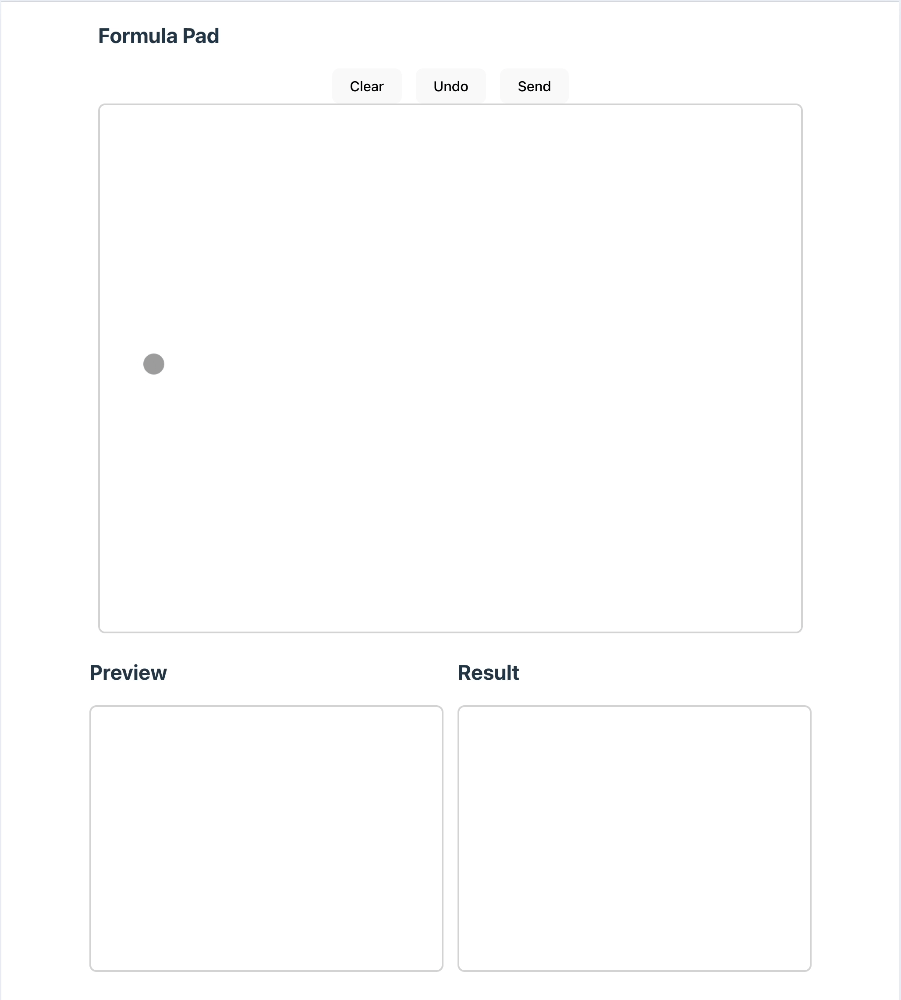

# GPT-4V Formula Pad

</img>


Setup

```bash
touch .env

# set the following variables in .env
OPENAI_API_KEY=[...]
```

Server

```bash
bun install
bun server.ts
```

Client

```bash
cd frontend
bun install
bun run dev
```
